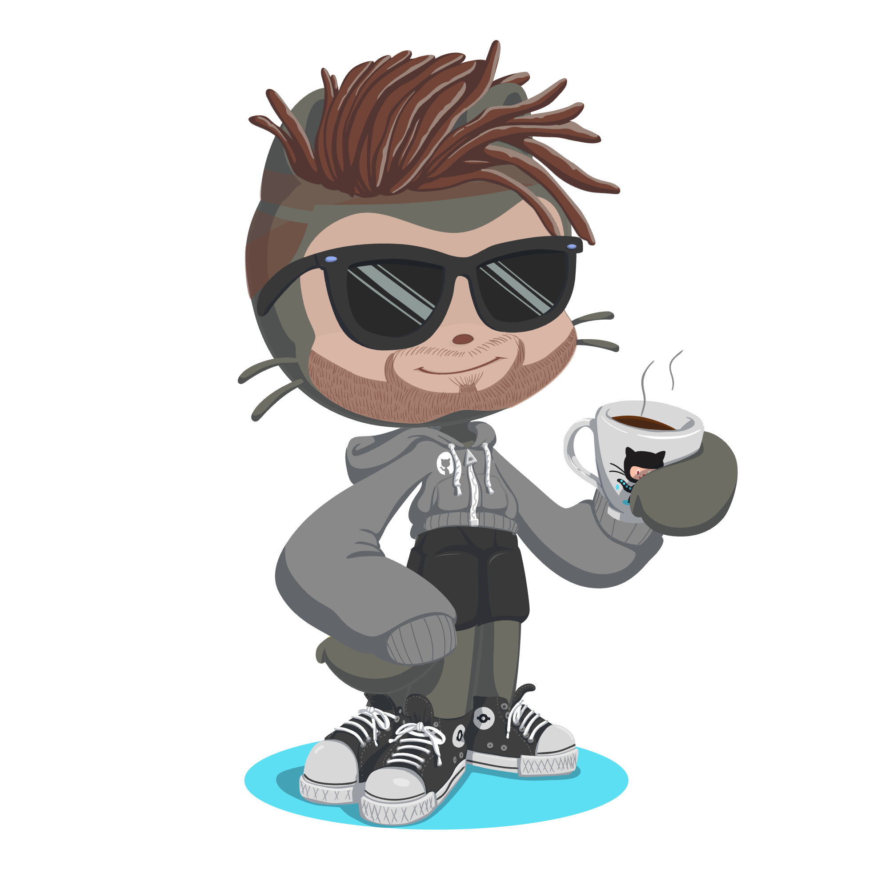

# Hi there, I`m [Andrew!](https://andrewalba.com) 🙋

I love everything about Full-Stack Web Development, Software Architecture, and AWS DevOps (even though I'm still a rookie). Let's code our way to the moon! 🚀

## 💬 Go ahead

Feel free to [ask me a question](https://github.com/andrewalba/andrewalba.github.io/discussions/categories/q-a) and let's see if I can impress you with my knowledge (or at least make you laugh with a silly answer).

## So what about me?

- [andrewalba.com](https://andrewalba.com) - My personal homepage, contains a musings and reviews
- [andrewalba.github.io](https://andrewalba.github.io) - My github projects visualized, source can be found [here](https://github.com/andrewalba/andrewalba.github.io)

## So hold on to your hats, folks, because we're about to dive into some data.
| Name | Stat |
| :--- | :---: |
| General Stats |  | 
| By Languages |  |
| The Streak |  |
| Trophies |  |

## Sharing repositories

Hey there, fellow coders! You know that feeling when you create something so cool that you just want to shout it from the rooftops? Well, that's how I feel about some of my work on Github and Bitbucket! Whenever I come up with something that could be helpful to others, I make it my mission to share it with the world. Sure, some of my stuff has been hiding out in private repositories, but fear not, my friends! I'm slowly but surely working to move as much of my work into the public eye as I can. Because let's face it, sharing is caring, and who knows? Maybe my code will help someone else create something even cooler. Let's keep the coding love flowing!

### Making time for projects

As much as I wish I could be a superhero and always be available to answer your questions and address any issues, unfortunately, I'm only human. If you don't hear back from me right away, it's probably because I'm off watching a baseball game or hiking somewhere. But fear not, my friends! I promise to always do my best to respond as quickly as I can to any questions, issues, or feedback you may have. Thanks for understanding and keep on coding!

### Requests for enhancements

Got a feature request? Awesome! I'm all ears. But before you hit that send button, know that I'll be giving it a good, hard think. I'm like a bouncer at the club - I'll only let in the requests that fit the vibe of the project and my personal style. So don't be offended if I have to turn down your request. It's not you, it's me.

## Let me introduce you to my fun-loving avatars!

|  |  |  | 
| :-------------------------------------------------------: | :-------------------------------------------: | :-------------------------------------------------------------------------------------------:  |
| Octocat                                                   | Bitmoji Avatar                              | Current gravatar                                                                               |

## Wanna buy me a coffee?

